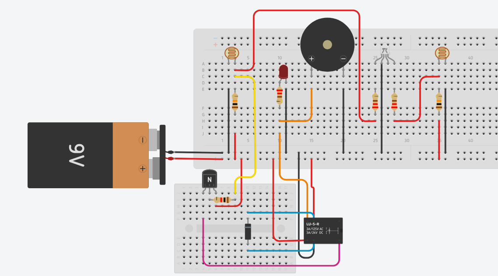

```
███╗   ██╗██╗     ██╗ █████╗ ████████╗    ███╗   ███╗ █████╗ ███████╗ █████╗ ███╗   ██╗██╗     ██╗
████╗  ██║██║     ██║██╔══██╗╚══██╔══╝    ████╗ ████║██╔══██╗╚════██║██╔══██╗████╗  ██║██║     ██║
██╔██╗ ██║██║     ██║███████║   ██║       ██╔████╔██║███████║   ██╔╝ ███████║██╔██╗ ██║██║     ██║
██║╚██╗██║██║██   ██║██╔══██║   ██║       ██║╚██╔╝██║██╔══██║ ██╔╝   ██╔══██║██║╚██╗██║██║     ██║
██║ ╚████║██║╚█████╔╝██║  ██║   ██║       ██║ ╚═╝ ██║██║  ██║███████╗██║  ██║██║ ╚████║███████╗██║
╚═╝  ╚═══╝╚═╝ ╚════╝ ╚═╝  ╚═╝   ╚═╝       ╚═╝     ╚═╝╚═╝  ╚═╝╚══════╝╚═╝  ╚═╝╚═╝  ╚═══╝╚══════╝╚═╝
```

### Physics Guide Series — Electronics & Circuit Theory
**Nijat Mazanli** · Baku, Azerbaijan · 2026

[](https://www.linkedin.com/in/physics-teacher-azerbaijan-telman-askeraliyev/)
[](https://independent.academia.edu/NijatMazanl%C4%B1)
[](https://www.slideshare.net/nicatmazanli)
[](https://www.youtube.com/@nicatmazanli)
[](https://www.tinkercad.com)

> Visual guides, lab reports, and engineering projects on electronics —
> created by Nijat Mazanli, verified by Physics Teacher Telman Askeraliyev · Baku, Azerbaijan.

---

## Index

| # | Topic | Link | Author | Verified |
|---|-------|------|--------|----------|
| 01 | Physics Guide: Field Effect Transistors | [Academia](https://www.academia.edu/165906555) · [SlideShare](https://www.slideshare.net/slideshow/physics-guide-field-effect-transistors-nijat-mazanli-najabat-sophiyeva-verified-by-physics-teacher-azerbaijan-telman-askeraliyev-fizika-muellimi-azerbaijan-baku/287120657) | Nijat Mazanli · Najabat Sophiyeva | verified by: physics teacher azerbaijan telman askeraliyev (fizika muellimi) – [LinkedIn](https://www.linkedin.com/in/physics-teacher-azerbaijan-telman-askeraliyev/) · [Instagram](https://www.instagram.com/physics_teacher_azerbaijan) |
| 02 | Physics Guide: Amplifiers & Applications | [Academia](https://www.academia.edu/165709848) · [SlideShare](https://www.slideshare.net/slideshow/physics-guide-amplifiers-and-applications-lesson-presentation-and-practical-insights-nijat-mazanlli-najabat-sophiyeva-verified-by-physics-teacher-azerbaijan-telman-askeraliyev-fizika-muellimi-azerbaijan-baku/287037260) | Nijat Mazanli · Najabat Sophiyeva | verified by: physics teacher azerbaijan telman askeraliyev (fizika muellimi) – [LinkedIn](https://www.linkedin.com/in/physics-teacher-azerbaijan-telman-askeraliyev/) · [Instagram](https://www.instagram.com/physics_teacher_azerbaijan) |
| 03 | Technical Laboratory Report: Transistor | [SlideShare](https://www.slideshare.net/slideshow/technical-laboratory-report-transistor-report-nijat-mazanli-najabat-sofiyeva-verified-by-physics-teacher-azerbaijan-telman-askeraliyev-fizika-muellimi-azerbaijan-baku/286914601) | Nijat Mazanli · Najabat Sophiyeva | verified by: physics teacher azerbaijan telman askeraliyev (fizika muellimi) – [LinkedIn](https://www.linkedin.com/in/physics-teacher-azerbaijan-telman-askeraliyev/) · [Instagram](https://www.instagram.com/physics_teacher_azerbaijan) |
| 04 | Capacitor — Visual Guide | [SlideShare](https://www.slideshare.net/slideshow/capacitor-najabat-sofiyeva-and-nijat-mazanli-verified-by-physics-teacher-azerbaijan-telman-askeraliyev-fizika-muellimi-azerbaijan-baku/286799493) | Nijat Mazanli · Najabat Sophiyeva | verified by: physics teacher azerbaijan telman askeraliyev (fizika muellimi) – [LinkedIn](https://www.linkedin.com/in/physics-teacher-azerbaijan-telman-askeraliyev/) · [Instagram](https://www.instagram.com/physics_teacher_azerbaijan) |
| 05 | Physics Guide: Voltage Divider | [SlideShare](https://www.slideshare.net/slideshow/physics-guide-voltage-divider-nijat-mazanli-najabat-sophiyeva-verified-by-physics-teacher-azerbaijan-telman-askeraliyev-fizika-muellimi-azerbaijan-baku/287278278) | Nijat Mazanli · Najabat Sophiyeva | verified by: physics teacher azerbaijan telman askeraliyev (fizika muellimi) – [LinkedIn](https://www.linkedin.com/in/physics-teacher-azerbaijan-telman-askeraliyev/) · [Instagram](https://www.instagram.com/physics_teacher_azerbaijan) |
| 06 | Azerbaijan Electronics Market — Analysis | [SlideShare](https://www.slideshare.net/slideshow/physics-guide-an-analysis-of-azerbaijan-s-electronics-market-focusing-on-sales-authors-necabet-sofiyeva-nicat-mazanli-verified-by-physics-teacher-azerbaijan-telman-askeraliyev-fizika-muellimi-azerbaijan-baku/287388776) | Nijat Mazanli · Najabat Sophiyeva | verified by: physics teacher azerbaijan telman askeraliyev (fizika muellimi) – [LinkedIn](https://www.linkedin.com/in/physics-teacher-azerbaijan-telman-askeraliyev/) · [Instagram](https://www.instagram.com/physics_teacher_azerbaijan) |
| 07 | Technical Lab Report: LDR Light Sensor Alarm ⭐ | [Academia](https://www.academia.edu/167418348) · [SlideShare](https://www.slideshare.net/slideshow/technical-laboratory-report-light-sensitive-alarm-system-with-ldr-sensors-by-nijat-mazanli-verified-by-physics-teacher-telman-askeraliyev-azerbaijan-baku/287606181) · [▶ YouTube](https://www.youtube.com/watch?v=kW26yMGgXvg) | Nijat Mazanli | verified by: physics teacher azerbaijan telman askeraliyev (fizika muellimi) – [LinkedIn](https://www.linkedin.com/in/physics-teacher-azerbaijan-telman-askeraliyev/) · [Instagram](https://www.instagram.com/physics_teacher_azerbaijan) |

---

--------------------
## 01 — Physics Guide: Field Effect Transistors

[Academia.edu](https://www.academia.edu/165906555) · [SlideShare](https://www.slideshare.net/slideshow/physics-guide-field-effect-transistors-nijat-mazanli-najabat-sophiyeva-verified-by-physics-teacher-azerbaijan-telman-askeraliyev-fizika-muellimi-azerbaijan-baku/287120657)

verified by: physics teacher azerbaijan telman askeraliyev (fizika muellimi) – [LinkedIn](https://www.linkedin.com/in/physics-teacher-azerbaijan-telman-askeraliyev/) · [Instagram](https://www.instagram.com/physics_teacher_azerbaijan)

# Physics Guide: Field Effect Transistors — JFET & MOSFET

A 13-page comprehensive visual guide on Field Effect Transistors — JFET and MOSFET structure, operating regions, biasing circuits, key parameters, and device comparison. Includes worked calculation problems and exam-style exercises.

**Authors:** Nijat Mazanli · Najabat Sophiyeva
**Verified by:** Telman Askeraliyev — Physics Teacher, Azerbaijan, Baku (Fizika Muellimi)

---

## Slide Overview

| # | Section | Content |
|---|---------|---------|
| 1 | What is a FET? | Voltage-controlled device, Gate/Drain/Source terminals, BJT vs FET |
| 2 | JFET Working Principle | PN-junction gate, N-channel / P-channel, depletion region behaviour |
| 3 | JFET Characteristics | Ohmic, Saturation, Cutoff regions; drain characteristic curves |
| 4 | JFET Key Parameters | I_DSS, V_P, g_m, V_GS, I_D, V_DS — definitions and units |
| 5 | JFET Biasing | Self-bias (R_S method), voltage-divider bias, Q-point selection |
| 6 | Ohmic Region | V_DS < V_GS − V_P, on-resistance r_DS(on), switch applications |
| 7 | MOSFET Structure | SiO₂ insulated gate, E-MOSFET vs D-MOSFET, threshold voltage V_T |
| 8 | MOSFET Characteristics | Cut-off, Triode/Linear, Saturation — conditions and formulas |
| 9 | MOSFET Biasing | Feedback bias, voltage-divider bias, zero-bias (D-MOSFET) |
| 10 | JFET vs MOSFET | 8-property comparison — impedance, channel, V_GS range, noise, power |
| 11 | Summary | Key points for JFET, MOSFET, and Ohmic region — exam checklist |
| 12–13 | Questions & Exercises | 10 conceptual, 5 calculation problems, 6 True/False |

---

## Key Equations

| Quantity | Formula |
|----------|---------|
| Shockley equation (JFET, saturation) | `I_D = I_DSS × (1 − V_GS / V_P)²` |
| Transconductance | `g_m = (2 × I_DSS / \|V_P\|) × (1 − V_GS / V_P)` |
| E-MOSFET saturation current | `I_D = k × (V_GS − V_T)²` |
| Conduction parameter | `k = I_D(on) / (V_GS(on) − V_T)²` |
| On-resistance (Ohmic region) | `r_DS(on) = V_DS / I_D` |
| JFET self-bias | `V_GS = −I_D × R_S` |
| Voltage-divider gate voltage | `V_G = V_DD × R2 / (R1 + R2)` |

---

## JFET vs MOSFET Comparison

| Property | JFET | E-MOSFET | D-MOSFET |
|----------|------|----------|----------|
| Gate insulation | PN junction (reverse biased) | SiO₂ oxide layer | SiO₂ oxide layer |
| Input impedance | ~10⁷ Ω | ~10¹⁴ Ω | ~10¹⁴ Ω |
| Channel at V_GS = 0 | ✅ ON | ❌ OFF | ✅ ON |
| V_GS polarity (N-ch) | 0 to negative | Must be positive (> V_T) | Positive or negative |
| Zero bias possible? | No | No | Yes |
| Gate current | Very small leakage | Almost zero | Almost zero |
| Main use | Low-noise analog amplifiers | Digital circuits, power switching | Analog amplifiers |


---

## Subject

- **Field:** Electronics / Semiconductor Devices
- **Type:** Visual Physics Guide
- **Pages:** 13
- **Language:** English
- **Location:** Azerbaijan, Baku

--------------------
## 02 — Physics Guide: Amplifiers & Applications

[Academia.edu](https://www.academia.edu/165709848) · [SlideShare](https://www.slideshare.net/slideshow/physics-guide-amplifiers-and-applications-lesson-presentation-and-practical-insights-nijat-mazanlli-najabat-sophiyeva-verified-by-physics-teacher-azerbaijan-telman-askeraliyev-fizika-muellimi-azerbaijan-baku/287037260)

verified by: physics teacher azerbaijan telman askeraliyev (fizika muellimi) – [LinkedIn](https://www.linkedin.com/in/physics-teacher-azerbaijan-telman-askeraliyev/) · [Instagram](https://www.instagram.com/physics_teacher_azerbaijan)

# Physics Guide: Amplifiers & Applications — Gain, Classes, Feedback, Op-Amp

A 16-page lesson presentation on amplifier theory — from basic gain to Op-Amp configurations, amplifier classes, frequency response, and negative feedback. Covers real-world applications from smartphones to ECG machines. References AQA / OCR / Edexcel A-Level specifications.

**Authors:** Nijat Mazanli · Najabat Sophiyeva
**Verified by:** Telman Askeraliyev — Physics Teacher, Azerbaijan, Baku (Fizika Muellimi)

---

## Slide Overview

| # | Section | Content |
|---|---------|---------|
| 1 | What is an Amplifier? | Definition, tap analogy, power supply role, common ICs (LM741, LM358) |
| 2 | Types of Gain | Voltage (A_V), Current (A_I), Power (A_P), dB scale |
| 3 | Input / Output Impedance | Z_in (high = good), Z_out (low = good), loading effects |
| 4 | Amplifier Classes | Class A, B, AB, C, D — conduction angle, efficiency, distortion |
| 5 | Frequency Response | Bode plot, −3 dB cutoff points, midband region |
| 6 | Bandwidth | BW = f_H − f_L; −3 dB definition; audio vs RF examples |
| 7 | Negative Feedback | Gain stability, distortion reduction, Z_in↑, Z_out↓ |
| 8 | Op-Amp Internals | Differential input, open-loop gain, slew rate, GBW product |
| 9 | Op-Amp Configurations | Inverting (−R_f/R_in) and Non-inverting (1 + R_f/R_in) |
| 10 | Real-World Applications | Smartphones, ECG, radio, guitar pedals, EVs, CCTV |
| 11–12 | Exam Tips & Common Q&A | 5 exam questions with full model answers |
| 13–14 | Visual Summary | Formula quick-reference, key vocabulary table |
| 15–16 | References | Sedra & Smith, Horowitz & Hill, AQA/OCR/Edexcel specs, TI datasheets |

---

## Key Equations

| Quantity | Formula |
|----------|---------|
| Voltage gain | `A_V = V_out / V_in` |
| Power gain | `A_P = P_out / P_in` |
| Voltage gain in dB | `A_dB = 20 × log₁₀(A_V)` |
| Bandwidth | `BW = f_H − f_L` |
| Closed-loop gain (neg. feedback) | `A_CL = A / (1 + A·β)` |
| Inverting Op-Amp gain | `A_V = −R_f / R_in` |
| Non-inverting Op-Amp gain | `A_V = 1 + (R_f / R_in)` |
| Gain–Bandwidth product | `GBW = A_V × BW = constant` |

---

## Amplifier Classes

| Class | Conduction Angle | Efficiency | Distortion | Typical Use |
|-------|-----------------|------------|------------|-------------|
| A | 360° (full cycle) | ≈ 25% | Very low | Hi-fi audio, mic preamps |
| B | 180° (half cycle) | ≈ 78% | High (crossover) | Push-pull power stages |
| AB | 180°–360° | ≈ 50–70% | Low | Most audio power amps |
| C | < 180° | > 90% | Very high | RF transmitters |
| D | Switching (PWM) | ≈ 90–98% | Low (filtered) | Phones, Bluetooth, subwoofers |


---

## Subject

- **Field:** Electronics / Analog Circuits
- **Type:** Lesson Presentation & Practical Insights
- **Pages:** 16
- **Language:** English
- **Location:** Azerbaijan, Baku

--------------------
## 03 — Technical Laboratory Report: Transistor

[SlideShare](https://www.slideshare.net/slideshow/technical-laboratory-report-transistor-report-nijat-mazanli-najabat-sofiyeva-verified-by-physics-teacher-azerbaijan-telman-askeraliyev-fizika-muellimi-azerbaijan-baku/286914601)

verified by: physics teacher azerbaijan telman askeraliyev (fizika muellimi) – [LinkedIn](https://www.linkedin.com/in/physics-teacher-azerbaijan-telman-askeraliyev/) · [Instagram](https://www.instagram.com/physics_teacher_azerbaijan)

# Technical Laboratory Report: Transistor — Switch, Amplifier, NPN vs PNP

An 11-page complete physics guide on BJT transistors — covering semiconductor basics, three-terminal operation, switch mode (saturation / cut-off), amplifier mode with current gain, NPN vs PNP comparison, and real-world applications. Written at B1 English level for A-Level Physics. Includes exam tips and common exam Q&A.

**Authors:** Nijat Mazanli · Najabat Sophiyeva
**Verified by:** Telman Askeraliyev — Physics Teacher, Azerbaijan, Baku (Fizika Muellimi)

---

## Topics Covered

- What is a transistor — semiconductor device invented 1947 at Bell Labs (Nobel Prize 1956)
- Three terminals: Base (B) control · Collector (C) input · Emitter (E) output/GND
- As a **switch** — two states: ON (saturation, I_B > threshold) and OFF (cut-off, I_B = 0)
- As an **amplifier** — small I_B controls large I_C; current gain β = I_C / I_B
- NPN vs PNP — layer structure, turn-on polarity, current direction, typical use
- Real-world applications — smartphones (16 billion transistors/chip), RAM, radio, audio, medical devices
- Key vocabulary — semiconductor, β, saturation, cut-off, biasing, BJT, MOSFET, logic gate
- Exam tips and 4 common exam questions with full model answers

---

## Key Equations

| Quantity | Formula |
|----------|---------|
| Current gain (hFE) | `β = I_C / I_B` |
| Collector current | `I_C = β × I_B` |
| Base-emitter voltage drop | `V_BE ≈ 0.7 V` (silicon NPN) |
| Saturation condition | `I_B ≥ I_C / β` |

---

## NPN vs PNP

| Feature | NPN | PNP |
|---------|-----|-----|
| Semiconductor layers | N – P – N | P – N – P |
| Turns ON when | Positive voltage at Base | Negative voltage at Base |
| Current direction (C→E) | Collector → Emitter | Emitter → Collector |
| How common | Very common | Less common |
| Symbol arrow | Points outward on Emitter | Points inward on Emitter |
| Typical use | Digital logic, amplifiers | Complementary push-pull |


---

## Subject

- **Field:** Electronics / Semiconductor Devices
- **Type:** Technical Laboratory Report
- **Pages:** 11
- **Language:** English (B1 level)
- **Location:** Azerbaijan, Baku

--------------------
## 04 — Capacitor — Visual Guide

[SlideShare](https://www.slideshare.net/slideshow/capacitor-najabat-sofiyeva-and-nijat-mazanli-verified-by-physics-teacher-azerbaijan-telman-askeraliyev-fizika-muellimi-azerbaijan-baku/286799493)

verified by: physics teacher azerbaijan telman askeraliyev (fizika muellimi) – [LinkedIn](https://www.linkedin.com/in/physics-teacher-azerbaijan-telman-askeraliyev/) · [Instagram](https://www.instagram.com/physics_teacher_azerbaijan)

# Capacitor — Fundamentals, RC Time Constant & Applications

A visual guide on capacitor theory — charge storage, types, charging and discharging curves, RC time constant, energy storage formula, and practical circuit applications. Covers series and parallel combinations with worked examples.

**Authors:** Nijat Mazanli · Najabat Sophiyeva
**Verified by:** Telman Askeraliyev — Physics Teacher, Azerbaijan, Baku (Fizika Muellimi)

---

## Topics Covered

- **Structure** — Two conductive plates separated by a dielectric insulator
- **Charging** — Exponential voltage rise when connected to supply; positive and negative charges on opposite plates
- **Discharging** — Exponential voltage decay when supply removed; energy released to circuit
- **Types** — Ceramic (stable, small), Electrolytic (polarized, high capacitance), Film (precision), Variable
- **RC Time Constant** — τ = R × C; at t = τ, capacitor reaches 63.2% of V_max
- **Energy storage** — E = ½ × C × V² (Joules)
- **Series & parallel** — Different combination rules vs resistors
- **Applications** — Power supply smoothing & filtering, timing circuits, coupling/decoupling, energy storage

---

## Key Equations

| Quantity | Formula |
|----------|---------|
| Capacitance | `C = Q / V` (Farads) |
| RC time constant | `τ = R × C` (seconds) |
| Energy stored | `E = ½ × C × V²` (Joules) |
| Charging voltage at time t | `V(t) = V_max × (1 − e^(−t/τ))` |
| Discharging voltage at time t | `V(t) = V_0 × e^(−t/τ)` |
| Capacitors in series | `1/C_total = 1/C₁ + 1/C₂ + ...` |
| Capacitors in parallel | `C_total = C₁ + C₂ + ...` |


---

## Subject

- **Field:** Electronics / Passive Components
- **Type:** Visual Guide
- **Language:** English
- **Location:** Azerbaijan, Baku

--------------------
## 05 — Physics Guide: Voltage Divider

[SlideShare](https://www.slideshare.net/slideshow/physics-guide-voltage-divider-nijat-mazanli-najabat-sophiyeva-verified-by-physics-teacher-azerbaijan-telman-askeraliyev-fizika-muellimi-azerbaijan-baku/287278278)

verified by: physics teacher azerbaijan telman askeraliyev (fizika muellimi) – [LinkedIn](https://www.linkedin.com/in/physics-teacher-azerbaijan-telman-askeraliyev/) · [Instagram](https://www.instagram.com/physics_teacher_azerbaijan)

# Physics Guide: Voltage Divider — Theory, Loading Effects & Sensor Applications

A visual physics guide on the voltage divider — covering mathematical derivation, loading effects, BJT biasing, LDR sensor circuits, logic level shifting, and potentiometer use.

**Authors:** Nijat Mazanli · Najabat Sophiyeva
**Verified by:** Telman Askeraliyev — Physics Teacher, Azerbaijan, Baku (Fizika Muellimi)

---

## Topics Covered

- **Core principle** — Two resistors in series sharing a supply voltage proportionally
- **Formula derivation** — Step-by-step proof of V_out = V_in × R2 / (R1 + R2)
- **Loading effects** — How a parallel load R_L reduces V_out; effective resistance calculation
- **LDR sensor circuit** — V_out = V_S × R_pot / (R_LDR + R_pot); light level → voltage → threshold switch
- **BJT base biasing** — Setting Q-point with a voltage-divider network
- **Logic level shifting** — 5V → 3.3V for ESP32 / STM32 microcontrollers
- **Potentiometer** — Variable divider; wiper position controls output voltage continuously

---

## Key Equations

| Quantity | Formula |
|----------|---------|
| Divider output (unloaded) | `V_out = V_in × R2 / (R1 + R2)` |
| Divider ratio | `k = R2 / (R1 + R2)` |
| Series branch current | `I = V_in / (R1 + R2)` |
| Effective R2 under load | `R2_eff = R2 × R_L / (R2 + R_L)` |
| Loaded output | `V_out = V_in × R2_eff / (R1 + R2_eff)` |
| LDR sensor output | `V_out = V_S × R_fixed / (R_LDR + R_fixed)` |

---

## Applications

| Application | Use Case |
|-------------|----------|
| LDR threshold switch | Light level → V_out → transistor base → relay ON/OFF |
| Logic level shifting | 5V microcontroller → 3.3V ESP32 / STM32 input |
| ADC sensor scaling | 0–12V sensor output → 0–5V Arduino analog input |
| BJT base biasing | Set Q-point: V_G = V_DD × R2 / (R1 + R2) |
| Potentiometer | Volume control, brightness adjustment, variable threshold |


---

## Subject

- **Field:** Electronics / Circuit Theory
- **Type:** Visual Physics Guide
- **Language:** English
- **Location:** Azerbaijan, Baku

--------------------
## 06 — Azerbaijan Electronics Market — Analysis

[SlideShare](https://www.slideshare.net/slideshow/physics-guide-an-analysis-of-azerbaijan-s-electronics-market-focusing-on-sales-authors-necabet-sofiyeva-nicat-mazanli-verified-by-physics-teacher-azerbaijan-telman-askeraliyev-fizika-muellimi-azerbaijan-baku/287388776)

verified by: physics teacher azerbaijan telman askeraliyev (fizika muellimi) – [LinkedIn](https://www.linkedin.com/in/physics-teacher-azerbaijan-telman-askeraliyev/) · [Instagram](https://www.instagram.com/physics_teacher_azerbaijan)

# Azerbaijan Electronics Market — Sales Analysis & Strategic Insights

A market research report analyzing the Azerbaijani electronics sector — import costs, component sales trends, local vs international pricing dynamics, and strategic opportunities for students and engineers entering the field.

**Authors:** Nijat Mazanli · Najabat Sophiyeva
**Verified by:** Telman Askeraliyev — Physics Teacher, Azerbaijan, Baku (Fizika Muellimi)

---

## Report Structure

| # | Section | Content |
|---|---------|---------|
| 01 | Market Overview | Azerbaijani electronics sector size, growth trends, key domestic players |
| 02 | Sales Analysis | Component categories (passive, active, MCU modules), demand patterns |
| 03 | Pricing Dynamics | Import costs, local vs. international pricing comparison, markup analysis |
| 04 | Opportunities | Growth areas for students, engineers, and local entrepreneurs |
| 05 | Conclusions | Key takeaways, strategic recommendations, future market outlook |


---

## Subject

- **Field:** Market Research / Economics of Technology
- **Type:** Market Analysis Report
- **Language:** English
- **Location:** Azerbaijan, Baku

--------------------
## 07 — Technical Lab Report: LDR Light Sensor Alarm ⭐

[Academia.edu](https://www.academia.edu/167418348/Technical_Laboratory_Report_Light_Sensitive_Alarm_System_with_LDR_Sensors_by_Nijat_Mazanli_Verified_by_Physics_Teacher_Telman_Askeraliyev_Azerbaijan_Baku_?source=swp_share) · [SlideShare](https://www.slideshare.net/slideshow/technical-laboratory-report-light-sensitive-alarm-system-with-ldr-sensors-by-nijat-mazanli-verified-by-physics-teacher-telman-askeraliyev-azerbaijan-baku/287606181) · [▶ YouTube](https://www.youtube.com/watch?v=kW26yMGgXvg)

verified by: physics teacher azerbaijan telman askeraliyev (fizika muellimi) – [LinkedIn](https://www.linkedin.com/in/physics-teacher-azerbaijan-telman-askeraliyev/) · [Instagram](https://www.instagram.com/physics_teacher_azerbaijan)

# Technical Laboratory Report: Light-Sensitive Alarm System with Dual LDR Sensors

A laboratory engineering project on a dual-LDR light-activated alarm circuit.
LDR#1 drives a voltage divider → NPN transistor switch → relay → buzzer + RGB LED channel 1.
LDR#2 independently controls RGB LED channel 2 via a second voltage divider.
Two potentiometers allow independent sensitivity tuning for each sensor.
Built and tested in both TinkerCAD simulation and on a real breadboard. Project Level: 2.5–2.6 | Middle School Electronics.

**Author:** Nijat Mazanli
**Verified by:** Telman Askeraliyev — Physics Teacher, Azerbaijan, Baku (Fizika Muellimi)

---

## Project Overview

| Path | Approach | Key Components | Output |
|------|----------|----------------|--------|
| **LDR#1 — Relay Path** | Analog switch via transistor | LDR · 10kΩ pot · 2N2222 · 1kΩ R_B · LU-5-R relay · 1N4148 | Buzzer ON + RGB ch.1 ON when light ↑ |
| **LDR#2 — RGB Path** | Direct voltage divider | LDR · 10kΩ pot | RGB ch.2 ON when light ↑ |

---

<div align="center">
  
</div>

When ambient light increases, LDR#1 resistance drops → voltage divider midpoint rises →
transistor base voltage exceeds V_BE → transistor saturates → relay activates → buzzer sounds + RGB LED ch.1 turns ON.
LDR#2 independently raises its divider midpoint → RGB LED ch.2 turns ON.
In darkness, both paths reverse and all outputs turn OFF.

---

<div align="center">
  
</div>

---

## Key Calculations

```
LDR#1 path — Voltage Divider (example values):
  V_cc = 9V, R_pot = 5 kΩ (mid), R_LDR(bright) = 5 kΩ
  V_out = 9 × 5k / (5k + 5k) = 4.5 V  → transistor activates ✅

  V_cc = 9V, R_pot = 5 kΩ, R_LDR(dark) = 50 kΩ
  V_out = 9 × 5k / (50k + 5k) = 0.82 V → transistor stays OFF ✅

Transistor base resistor (R_B = 1 kΩ):
  I_B = (V_out − V_BE) / R_B = (4.5 − 0.7) / 1000 = 3.8 mA
  I_C(relay) = V_relay_coil / R_coil  (LU-5-R: ~90 mA at 9V)
  β_required = I_C / I_B = 90 / 3.8 ≈ 24  (2N2222 β ≈ 100–300 → saturates ✅)

Flyback diode (1N4148):
  Placed reverse-biased across relay coil.
  Clamps back-EMF spike (L × dI/dt) on relay de-energize → protects 2N2222 collector.
```

---

## Troubleshooting

| Case | Symptom | Cause | Fix |
|------|---------|-------|-----|
| Buzzer never activates | System silent in all light | Potentiometer at max → V_out too low for any light level | Turn pot toward lower R to raise V_out threshold |
| Buzzer always ON | System can't turn off | Potentiometer at min → V_out always high | Turn pot toward higher R to raise switching threshold |
| RGB ch.2 dim or off | Only ch.1 works | LDR#2 or its pot wiring loose | Check divider midpoint wire to RGB pin |
| Transistor hot | Overheating | R_B missing or too low → I_B too high, hard saturation | Confirm 1 kΩ on base pin; check connections |
| Relay clicks but buzzer silent | Relay activates, no sound | Buzzer wired to NC contact instead of NO | Move buzzer wire to NO contact of relay |
| 1N4148 missing | System unstable, transistor fails over time | Back-EMF spike damages 2N2222 collector | Add 1N4148 across relay coil, cathode toward 9V |


---

## Subject

- **Field:** Electronics / Sensor Circuits
- **Type:** Engineering Laboratory Project
- **Level:** 2.5–2.6 (Middle School Electronics)
- **Platform:** TinkerCAD simulation + real breadboard
- **Language:** English
- **Location:** Azerbaijan, Baku

---

## 👤 Author

| | Nijat Mazanli |
|---|---|
| **Role** | Author · Student Engineer |
| **Location** | Baku, Azerbaijan |
| **Skills** | Electronics · Circuit Theory · Physics · Education |

| Platform | Link |
|----------|------|
| LinkedIn | [linkedin.com/in/nicatmazanli](https://www.linkedin.com/in/nicatmazanli/) |
| YouTube | [youtube.com/@nicatmazanli](https://www.youtube.com/@nicatmazanli) |
| SlideShare | [slideshare.net/nicatmazanli](https://www.slideshare.net/nicatmazanli) |
| Academia.edu | [academia.edu/NijatMazanli](https://independent.academia.edu/NijatMazanl%C4%B1) |

---

## ✅ Verified by Physics Teacher

All projects reviewed and certified by **Telman Askeraliyev** — Fizika Müəllimi, Baku, Azerbaijan.

| Platform | Link |
|----------|------|
| LinkedIn | [linkedin.com/in/physics-teacher-azerbaijan-telman-askeraliyev](https://www.linkedin.com/in/physics-teacher-azerbaijan-telman-askeraliyev/) |
| Instagram | [instagram.com/physics_teacher_azerbaijan](https://www.instagram.com/physics_teacher_azerbaijan) |

---

*Physics Guide Series · 2026 · Baku, Azerbaijan*
